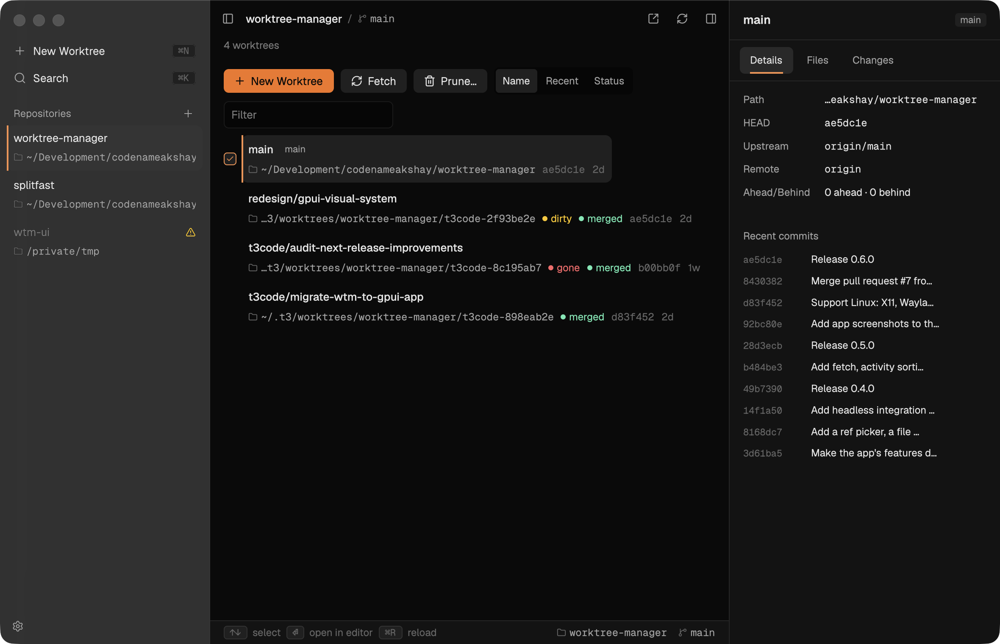
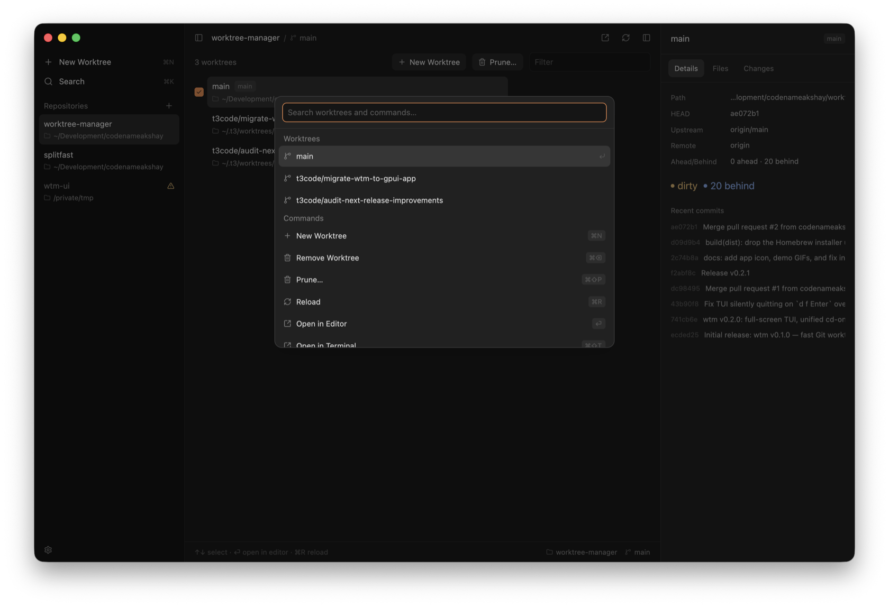

<div align="center">


# wtm

**A fast, ergonomic Git worktree manager.**

<p>
  
  
  
</p>

</div>

`wtm` makes `git worktree` pleasant to use day to day: it discovers worktrees
straight from git's own registry (so it works no matter where they live on
disk, even ones created by a raw `git worktree add`), computes status
(dirty/ahead/behind/merged) in parallel, and gets out of your way with a
tiny, scriptable command set.

<p align="center">
  
</p>

- **Registry-based, location-agnostic.** `wtm` doesn't keep its own database
  of worktrees — it reads git's registry directly, so it discovers every
  worktree for the current repo, wherever it was created and however it was
  created.
- **Fast by default.** `wtm list` is built to run in well under ~50ms for a
  repo with 10-20 worktrees, with status for every worktree computed in
  parallel (`git2` + `rayon`, one repository open per worktree). Pass
  `--no-status`/`--fast` for near-instant enumeration when you don't need
  status at all.
- **Safe by default.** Dirty worktrees refuse to be removed without
  `--force`. Branches are never deleted unless you explicitly opt in.
  Protected branches (`main`, `master`, `develop` by default) are never
  touched.

## Install

### Prebuilt binaries via installer script (recommended)

```sh
curl --proto '=https' --tlsv1.2 -LsSf https://github.com/codenameakshay/wtm-manager/releases/latest/download/wtm-installer.sh | sh
```

The script downloads the right prebuilt binary for your platform and puts it
on your `PATH`. Binaries are published for:

- macOS: `aarch64` (Apple Silicon), `x86_64` (Intel)
- Linux: `x86_64`, `aarch64`

You can also grab an archive by hand from the
[GitHub Releases](https://github.com/codenameakshay/wtm-manager/releases)
page and drop the `wtm` binary on your `PATH`. Release artifacts and the
one-line installer are generated by
[cargo-dist](https://opensource.axo.dev/cargo-dist/).

### From source (cargo)

```sh
cargo install --git https://github.com/codenameakshay/wtm-manager --locked
```

> **Note:** install from git as shown above — the crate name `wtm` on
> crates.io belongs to a different, unrelated project, so `cargo install wtm`
> will **not** install this tool. Homebrew support is planned but not wired
> up yet.

After installing, wire up the shell integration so `wtm switch` and the TUI's
`Enter` can actually `cd` you into a worktree — see [Shell setup](#shell-setup).

## Quickstart

```sh
cd my-project                      # inside a git repo

wtm add feature/login              # create a new branch + worktree
wtm add --from origin/main hotfix  # branch a new worktree off a specific base

wtm list                           # see every worktree, with status
wtm list --json                    # machine-readable output for scripts
wtm list --fast                    # skip status computation entirely

wtm switch feature/login           # cd into a worktree (needs shell setup, see below)
wtm open feature/login             # open a worktree in $EDITOR

wtm remove hotfix                  # remove a worktree (refuses if dirty)
wtm prune --merged --gone          # clean up merged / upstream-gone worktrees

wtm                                 # opens the desktop app on a terminal
wtm tui                             # or launch the terminal UI directly
```

`wtm list` shows the main worktree first, then every linked worktree, with
status badges filled in for each:

<p align="center">
  
</p>

## App

`wtm` also ships a native desktop app, built with
[GPUI](https://github.com/zed-industries/zed/tree/main/crates/gpui) (the UI
framework behind Zed). On a terminal, bare `wtm` opens it — falling back to
the [TUI](#tui) when the app isn't installed, and to the TUI (with a warning)
if the app is installed but fails to launch. `wtm app` (alias `wtm gui`)
opens it explicitly and errors instead of falling back if it isn't
installed. Every other subcommand is unchanged, and a piped/non-TTY
invocation of bare `wtm` — a script, an agent, CI — still just prints help
and exits `0`; it never opens a window any more than it opens a full-screen
UI.

<p align="center">
  
</p>

**Installing it.** macOS and Linux are both supported now; Windows is not.

**macOS:**

- Build it yourself: `scripts/bundle-mac.sh` assembles `WTM.app` from source
  (see [`scripts/README.md`](scripts/README.md)). Install with
  `cp -R target/bundle/WTM.app /Applications/`.
- Download `WTM-macOS.zip` from the
  [latest release](https://github.com/codenameakshay/wtm-manager/releases)
  and unzip it.

Either way, **be aware it is ad-hoc signed, not notarized by Apple** — there
is no Developer ID certificate behind it. The first time you launch it
(including a build you made yourself, once it's picked up a quarantine flag
from a download), Gatekeeper will refuse to open it normally: right-click
`WTM.app` and choose **Open**, then confirm, to get past that one-time
warning.

**Linux** (`x86_64` and `aarch64`):

- Download `WTM-linux-x86_64.tar.xz` or `WTM-linux-aarch64.tar.xz` from the
  [latest release](https://github.com/codenameakshay/wtm-manager/releases),
  extract it, and run the bundled installer:

  ```sh
  tar -xJf WTM-linux-x86_64.tar.xz
  ./wtm-gui-*-linux/install.sh          # into ~/.local, no root required
  ```

  (`install.sh --system`, run with `sudo`, installs into `/usr/local`
  instead.) It also installs a `.desktop` entry and icons so the app shows
  up in your application launcher.
- Or download `WTM-linux-x86_64.deb`/`WTM-linux-aarch64.deb` and install it
  with your package manager, e.g. `sudo apt install
  ./WTM-linux-x86_64.deb`.

Either package needs `libvulkan1` and `libwayland-client0` at runtime — GPUI
loads both with `dlopen` at startup rather than linking them, so they won't
show up as missing until the app actually tries to open a window — on top of
the base libraries most desktop Linux installs already have (`libc6`,
`libgcc-s1`, `zlib1g`, `libxcb1`, `libxkbcommon0`, `libxkbcommon-x11-0`). The
`.deb` declares all of these as dependencies, so `apt`/`dpkg` pull them in
automatically; installing from the tarball, install them yourself if
they're missing:

```sh
sudo apt install libvulkan1 libwayland-client0 libxkbcommon-x11-0 \
  libxcb1 libxkbcommon0 zlib1g libgcc-s1 libc6
```

**Be honest with yourself about how tested this is.** The Linux build is
verified in CI — it compiles, passes `wtm-gui`'s test suite, and passes
Clippy on `ubuntu-latest` (x86_64) and `ubuntu-24.04-arm` (aarch64) — but it
has **not** been run on a real Linux desktop by the maintainer. Treat it as
"builds and tests cleanly," not "battle-tested," until that changes. Windows
remains unsupported: GPUI has a Windows backend, but this app has never been
built against it.

Once installed, the CLI finds it automatically, checking in order:
`$WTM_APP` (an explicit path, for development); on macOS,
`/Applications/WTM.app` then `~/Applications/WTM.app`; a `wtm-gui` binary
next to the `wtm` binary itself; on Linux, `~/.local/bin/wtm-gui`,
`/usr/local/bin/wtm-gui`, then `/usr/bin/wtm-gui`; and finally `wtm-gui` on
`$PATH`.

**Adding a repository.** Click the `+` next to "Repositories" in the
sidebar, press `⌘⇧O`, or (with no repositories open yet) use the "Add
Repository…" row in the sidebar's empty state — any of the three opens a
native folder picker; pick a git repository and it's added to the sidebar
and opened.

**What it does:** a sidebar of every repository you've opened (most
recent first), a worktree list with live status — sortable by Name,
Recent, or Status, each row showing its last-commit age, main always
pinned first — that stays current via a filesystem watcher without a
manual reload, create/remove/prune dialogs, a Fetch button/`⌘⇧F` that runs
`git fetch --prune` and refreshes ahead/behind counts and "upstream gone"
detection, a detail panel with Details/Files/Changes tabs (upstream, path,
HEAD, dirty files, recent commits; a gitignore-aware file tree; an inline
diff of uncommitted changes), a searchable base-ref picker for new
worktrees (local and remote-tracking refs, tagged `current`/`default`/
`worktree`/`remote`), running an arbitrary command in a worktree with live
streamed output and per-repository recent-command suggestions (`⌘E`),
opening a worktree's branch on its GitHub/GitLab/Bitbucket remote, a ⌘K
command palette with fuzzy search over worktrees and actions,
type-to-filter, multi-select (shift/⌘-click or a row checkbox) with bulk
remove, right-click context menus covering the full action set, and a
settings sheet. See [`docs/app.md`](docs/app.md) for the full guide.

<p align="center">
  
</p>

| Shortcut | Action |
| --- | --- |
| `⌘Q` | Quit |
| `⌘R` | Reload |
| `⌘⇧F` | Fetch |
| `⏎` | Open in Editor |
| `↓` | Select Next |
| `↑` | Select Previous |
| `⌘B` | Toggle Sidebar |
| `⌘N` | New Worktree |
| `⌘⌫` / `⌦` | Remove Worktree |
| `⌘⇧P` | Prune Worktrees |
| `⌘C` | Copy Path |
| `⌘⇧T` | Open in Terminal |
| `⌘⇧R` | Reveal in Finder |
| `⎋` | Close Dialog or Menu |
| `⌘I` | Toggle Detail Panel |
| `⌘1` | Detail Panel: Details Tab |
| `⌘2` | Detail Panel: Files Tab |
| `⌘3` | Detail Panel: Changes Tab |
| `⌘,` | Settings |
| `⌘K` | Command Palette |
| `⌘F` | Filter Worktrees |
| `⌘⇧O` | Add Repository |
| `⌘E` | Run Command |

The same table is generated inside the app itself (Settings → Keyboard
Shortcuts) from the same source, so it can't drift from what's actually
bound.

**State.** The app keeps two files of its own alongside the CLI's
`~/.config/wtm/config.toml` (honoring the same `$WTM_CONFIG_DIR`/
`$XDG_CONFIG_HOME` overrides): `~/.config/wtm/repos.json` (the sidebar's
repository list) and `~/.config/wtm/gui.json` (appearance, panel visibility,
window frame, last-opened repo). Neither is read by the CLI. The app never
writes to `.worktree.toml` or `config.toml` — those stay exactly what the
[Configuration](#configuration) section below describes, shared read-only
with the CLI (the settings sheet shows the effective values with a link to
reveal the actual file).

## TUI

`wtm tui` (alias `wtm ui`) launches a full-screen interactive interface for
browsing and managing worktrees. It's what bare `wtm` falls back to on a
terminal when the [desktop app](#app) isn't installed. In a non-TTY context
(piped output, agents, CI) bare `wtm` prints help and exits `0` regardless —
it never opens a full-screen UI, or a window, somewhere that can't show
one.

Status (dirty/ahead/behind/merged/upstream-gone) loads in the background,
so the worktree list appears instantly and status badges fill in as they
resolve.

Layout: the left pane lists every worktree with status badges (branch,
short HEAD, ahead/behind, dirty, merged/gone/missing markers); the right
pane shows details for the selected worktree (upstream, path, HEAD, dirty
files, recent commits).

| Key | Action |
| --- | --- |
| `j`/`k` or `↓`/`↑` | Move selection |
| `g` / `G` | Jump to first / last |
| `Enter` | Switch to worktree (cd on exit, via shell wrapper) |
| `n` | New worktree (branch + base form; runs setup automation) |
| `d` | Remove selected worktree (confirm; force required if dirty) |
| `Space` | Toggle multi-select |
| `p` | Prune merged/gone/missing (or multi-selected rows) with confirm |
| `o` | Open in configured editor |
| `x` | Run a command in the worktree |
| `y` | Copy worktree path |
| `/` | Fuzzy filter |
| `r` | Refresh status |
| `?` | Help overlay |
| `q` / `Esc` | Quit |

## Shell setup

`wtm` is a regular binary, and a child process can never change its parent
shell's working directory. So that `wtm switch`, `wtm add --cd`, and the
TUI's `Enter` action can actually `cd` you into a worktree, add an `eval` of
`wtm init <shell>` to your shell rc file. This installs a small shell
function named `wtm` that wraps the binary using a temp-file cd mechanism:
it creates a temp file, exports its path as `$WTM_CD_FILE`, runs the real
`wtm` binary with your original arguments, and — only after a successful
command — reads the byte-safe target and uses `cd --` to enter it. It then
cleans the private temp file and preserves the command or `cd` exit status.
`wtm switch`, `wtm add --cd`, and the
TUI's `Enter` action all write to `$WTM_CD_FILE` when it's set; every other
subcommand is unaffected. It also wires up completions.

<p align="center">
  
</p>

This replaces the old stdout-capture-based wrapper: the temp-file mechanism
works uniformly for plain commands *and* for the full-screen TUI, which owns
the terminal and can't have its stdout captured that way.

**zsh** (`~/.zshrc`):

```sh
eval "$(command wtm init zsh)"
```

**bash** (`~/.bashrc`):

```sh
eval "$(command wtm init bash)"
```

Open a new shell (or `source` your rc file) afterwards. Without this, `wtm
switch`/`wtm add --cd`/the TUI's `Enter` still work, but only print the
target path — they can't move you there themselves; `wtm switch`'s stderr
will remind you to run `wtm init` when this happens.

## Commands

Global flags apply to every subcommand:

| Flag | Description |
| --- | --- |
| `-C, --repo <PATH>` | Operate on the repository at `PATH` instead of the current directory. |
| `--color <auto\|always\|never>` | Control colored output. `auto` (default) colors when stdout is a TTY and `NO_COLOR` is unset. |
| `-v, --verbose` | Verbose output. |
| `-q, --quiet` | Quiet output (conflicts with `-v`). |

### `wtm add <branch>` (aliases: `new`, `create`)

Create a worktree for `<branch>`. If `<branch>` already exists locally it is
checked out as-is (error if it's already checked out in another worktree);
otherwise a new branch is created from a base. Any configured setup
automation (`setup.commands`/`setup.copy`) runs in the fresh worktree:

<p align="center">
  
</p>

| Flag | Description |
| --- | --- |
| `--from <base>` | Base ref for a new branch. Must resolve to a commit. If omitted, uses `default_base`, then `HEAD`. |
| `--path <path>` | Explicit destination path, overriding the path template. |
| `--cd` | After creating, `cd` into the new worktree (shell wrapper required — see above). |
| `--open` | Open the new worktree in your editor after creation. |
| `--no-setup` | Skip running `setup.commands`/`setup.copy` for this worktree. |

Refuses if the destination path already exists. Setup automation failures
are reported but the worktree is kept — fix the issue and rerun the setup
commands yourself, or `wtm rm` it.

### `wtm list` (alias: `ls`)

List every worktree in the repo's registry: the main worktree first, then
every linked worktree, wherever it lives on disk. Missing (moved/deleted)
worktrees are shown, never treated as an error.

| Flag | Description |
| --- | --- |
| `--json` | Emit a JSON array instead of a table. |
| `--no-status`, `--fast` | Skip per-worktree status computation (dirty/ahead/behind/merged) for near-instant enumeration. |

Columns: `NAME` (branch, or registry name for detached/unnamed heads — main
is marked), `PATH` (`~`-abbreviated), `HEAD` (short sha), `AHEAD/BEHIND`
(`↑2 ↓1`, `-` with no upstream, `gone` when the upstream ref was deleted),
and status badges (`dirty`, `merged`, `missing`, `locked`, `prunable`). The
status-derived columns are omitted entirely when status was skipped.

### `wtm remove <name>` (alias: `rm`)

Remove a worktree. `<name>` matches a registry entry name, a branch name, or
an unambiguous substring of either; if omitted, an interactive picker is
shown (requires stdin and stderr to be TTYs).

| Flag | Description |
| --- | --- |
| `--force` | Remove even if the worktree has uncommitted changes. |
| `--with-branch` | Also delete the branch after removal (refused for protected branches). |

Refuses to remove the main worktree, and refuses to remove a worktree that
contains your current directory. A worktree whose directory is already gone
from disk is safely dropped from the registry.

### `wtm switch <name>` (aliases: `cd`, `sw`)

Resolve `<name>` (or show the picker) and print its path so the shell
wrapper can `cd` there. Without the shell wrapper installed, this just
prints the path (plus a hint to set up `wtm init`) — see
[Shell setup](#shell-setup).

### `wtm prune` (alias: `clean`)

Clean up worktrees that no longer need to exist. Candidates are: entries
whose directory is missing or that git considers prunable (always), plus
(opt-in) merged and upstream-gone branches.

<p align="center">
  
</p>

| Flag | Description |
| --- | --- |
| `--merged` | Also include worktrees whose branch is merged into the resolved base. |
| `--gone` | Also include worktrees whose upstream branch was deleted remotely. |
| `--dry-run` | Print the plan and exit without changing anything. |
| `--force` | Proceed even if a candidate worktree is dirty. |

The main worktree and any `protected_branches` are never candidates.
Branches for merged/gone candidates are deleted as part of pruning (that's
the point); missing-directory entries only have their registry entry
cleaned up — their branch, if any, is left alone. Always finishes with
`git worktree prune`.

### `wtm open [name]`

Open a worktree in your editor (resolves `<name>`, or shows the picker if
omitted).

| Flag | Description |
| --- | --- |
| `--with <cmd>` | Run `<cmd>` (via `sh -c`) in the worktree instead of launching an editor; waits for it and propagates its exit status. |

Editor resolution order: `config.editor` > `$VISUAL` > `$EDITOR`. Errors if
none is set and `--with` wasn't given.

### `wtm path [name]`

Print a worktree's path and nothing else — no interactive picker, ever, so
it's safe to use in scripts. If `<name>` is omitted, prints the nearest Git
worktree root containing your current directory.

### `wtm app` (alias: `gui`)

Open the desktop app explicitly — see [App](#app) above. Unlike bare `wtm`,
this errors (naming `wtm tui` as the alternative) rather than falling back
to the TUI when the app isn't installed, and it isn't gated on running from
a terminal.

### `wtm tui` (alias: `ui`)

Launch the full-screen interactive TUI — see [TUI](#tui) above. Bare `wtm`
opens the app instead on a TTY, falling back to this when the app isn't
installed; elsewhere it prints help.

### `wtm init <shell>`

Print the shell integration snippet for `zsh` or `bash` — see
[Shell setup](#shell-setup).

### `wtm completions <shell>`

Print a shell completion script for the given shell.

### `wtm config path` / `wtm config init`

`wtm config path` prints the global config file path and, when run inside a
repo, the repo-level config paths, each annotated with whether it currently
exists.

`wtm config init` scaffolds a fully commented `.worktree.toml` at the repo
root (errors if one already exists) — see [Configuration](#configuration).

## Configuration

Configuration is layered; each later layer overrides the previous one
**field-by-field** (setting only `editor` in a repo config does not reset
`path_template` from an earlier layer). List-valued fields (`setup.copy`,
`prune.protected_branches`, and trusted `setup.commands`) are **replaced**,
not merged, by whichever permitted layer last sets them.

Layering order (later wins):

1. Built-in defaults
2. `~/.config/wtm/config.toml` (global; honors `$WTM_CONFIG_DIR` and
   `$XDG_CONFIG_HOME/wtm` — see `wtm config path`)
3. `<repo>/.worktree.toml` (checked in, shared with your team)
4. `<repo>/.worktree.local.toml` (git-ignored, machine-local overrides)
5. Command-line flags

Run `wtm config init` to scaffold a starter `.worktree.toml`, or write one by
hand. All keys are optional:

```toml
# .worktree.toml — repo-level wtm configuration.
# Run `wtm config path` to see where every config layer lives on this machine.

# Template used to compute the destination path for NEW worktrees created by
# `wtm add`. This ONLY affects where new worktrees are placed — it never
# affects how `wtm list`/`wtm switch`/etc. discover EXISTING worktrees; those
# are always read from git's own registry.
#
# Placeholders:
#   {repo}      main working tree's directory name
#   {branch}    branch name, as given (may contain '/')
#   {slug}      filesystem-safe slug of {branch} ('/' and other unsafe
#               characters become '-')
#   {home}      the user's home directory
#   {repo_dir}  absolute path to the main working tree
path_template = "../{repo}-worktrees/{branch}"

# Base ref used to decide whether a branch counts as "merged" (for `wtm list`
# and `wtm prune --merged`), and as the default base for `wtm add` when the
# branch doesn't exist yet (overridable per-call with `wtm add --from`).
# Unset (the built-in default) falls back to the main worktree's HEAD.
default_base = "origin/main"

# Files/directories copied or symlinked from the main worktree into every
# new worktree. Sources must be relative paths contained in the main
# worktree. Symlinks and parent-directory traversal are rejected. Existing
# destination files are never overwritten; missing sources are skipped.
[[setup.copy]]
path = ".env"
mode = "copy" # "copy" | "symlink" — symlink targets the ABSOLUTE source path

[[setup.copy]]
path = ".envrc"
mode = "symlink"

[prune]
# Branches that `wtm prune` and `wtm remove --with-branch` will never
# delete, and that are never selected as prune candidates.
protected_branches = ["main", "master", "develop"]
```

Executable values (`editor` and setup commands) are deliberately rejected in
the checked-in `.worktree.toml`: cloning or checking out a repository must not
grant it code execution on your machine. Put trusted, machine-local values in
`.worktree.local.toml` (and git-ignore it) or the global config instead:

```toml
# .worktree.local.toml
editor = "code --wait"

[setup]
commands = ["npm install"]
```

## Safety model

- `wtm remove`/`wtm prune` refuse to touch a worktree with uncommitted
  changes (dirty: modified, staged, or untracked files) unless `--force` is
  given.
- Branches are **never** deleted as a side effect. `wtm remove` only deletes
  a branch with explicit `--with-branch`; `wtm prune` only deletes branches
  for candidates it's specifically cleaning up (`--merged`/`--gone`), never
  for missing-directory entries.
- `protected_branches` (default `main`, `master`, `develop`) are never
  deleted and never selected as prune candidates, regardless of flags.
- The main worktree can never be removed or pruned.
- Removing the worktree that contains your current directory is refused.
- Explicit/default base refs must resolve to commits; a typo never silently
  changes merged detection or creates a branch from an unintended `HEAD`.
- Setup copy paths cannot escape the main worktree, traverse through
  symlinks, or write through symlinked destination parents.
- Pruning continues past independent failures, always refreshes Git's
  registry, and returns a combined failure report.

## Performance

`wtm list` is designed for large worktree fleets with status included. To
keep enumeration responsive:

- Reads never spawn a `git` subprocess — everything goes through `git2`
  directly against the on-disk object/ref database.
- `wtm list --no-status`/`--fast` does no per-worktree repository opens
  beyond the cheap registry/HEAD reads.
- With status enabled, per-worktree status (dirty/ahead/behind/upstream-gone/
  merged) is computed in parallel with `rayon`, one `git2::Repository` open
  per worktree.

To measure it yourself:

```sh
cargo bench                 # criterion benchmarks, benches/list.rs
```

CI enforces a release-mode performance gate on every push. The gate builds a
64-linked-worktree fixture (65 worktrees including main), audits cold-start
and warm behavior separately, and requires the first full status load to stay
under 1 second and the median of 11 warm runs to stay under 500ms. These are
CI-noise-tolerant ceilings, not typical local timings. Run it locally with:

```sh
cargo test --release --locked --test perf_gate -- --ignored --nocapture
```

## Development

```sh
cargo test --all-targets --all-features --locked
cargo fmt --all             # format
cargo fmt --all --check     # check formatting (what CI runs)
cargo clippy --all-targets --all-features --locked -- -D warnings
RUSTDOCFLAGS="-D warnings" cargo doc --no-deps --all-features --locked
cargo audit --file Cargo.lock
```

The README's terminal recordings are produced with
[VHS](https://github.com/charmbracelet/vhs) from the tape scripts in
[`assets/tapes/`](assets/tapes); the app icon is built with Icon Composer and
its source lives in [`assets/wtm.icon`](assets/wtm.icon).

## Agent Skill

This repo bundles an [Anthropic Agent Skill](https://www.anthropic.com/news/skills)
at `skills/wtm/` that teaches a coding agent how to install and drive `wtm` —
installation, the core commands with `--json`/non-interactive usage patterns
for agents, and a full command/config/TUI reference.

Install it by copying the folder into your Claude Skills directory:

```sh
cp -r skills/wtm ~/.claude/skills/wtm
```

After that, telling a coding agent something like "install and use the wtm
worktree manager" just works. The skill's `skills/wtm/scripts/install.sh`
also works standalone as an automated installer (git check, best-available
install method, optional shell integration).

## License

Licensed under either of

- MIT license ([LICENSE-MIT](LICENSE-MIT))
- Apache License, Version 2.0 ([LICENSE-APACHE](LICENSE-APACHE))

at your option.
